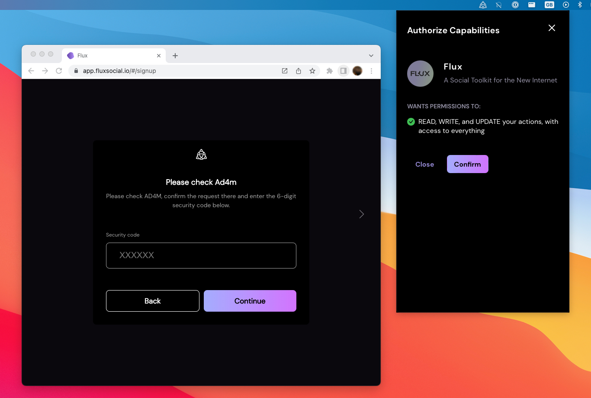

# Connecting to AD4M

Flux runs on top of [AD4M](https://ad4m.dev), a p2p framework where all data is stored on your device and shared with others in Neighbourhoods. In order to build a new Flux app you need to download and install AD4M.

After downloading AD4M, create new user (agent), and we are ready to go!

<j-button href="https://ad4m.dev/download" variant="primary">Download AD4M</j-button>

## Authorize your app

Once you have your app running you'll need to authorize your app to access your AD4M data. This is handled by `ad4m-connect` as shown below:



### Using create-flux-app

With create-flux-app the AD4M Connect logic is included (through the `flux-container` web-component) and resides in the `index.html` file. Just make sure you have AD4M running.

### Manual setup

If you're not using `create-flux-app` you can just install our `@fluxapp/flux-wrapper` web-component and put your Flux app inside the container for testing purposes.

```html
<html>
  <head>
    ...
  </head>
  <body>
    <flux-container>
      <flux-app></flux-app>
    </flux-container>
    <script type="module">
      // Flux wrapper for testing
      import "@fluxapp/flux-container";

      // Your Flux app (web component)
      import MyFluxApp from "./App.js";

      customElements.define("flux-app", MyFluxApp);
    </script>
  </body>
</html>
```
