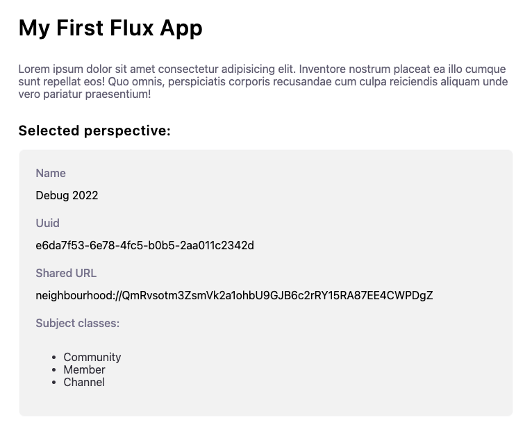

# Quick Start

## Download AD4M

Flux runs on top of [AD4M](https://ad4m.dev), a p2p framework where all data is stored on your device and shared with others in Neighbourhoods. In order to build a new Flux app you need to download and install AD4M.

After downloading AD4M, create new user (agent), and we are ready to go!

<j-button href="https://ad4m.dev/download" variant="primary">Download AD4M</j-button>

## Create a new project

To create a new Flux App, run in your terminal:

```bash
npx create-flux-app
```

The terminal will ask you for the name of your app, as well as what framework you want to use (for now we only support preact).

Then install the dependencies and start your development server:

```bash
cd [app-name]
npm install
npm run dev
```

## Make a new community to test your app in

Once you have your app running give your app access to your AD4M data. The AD4M popup will handle this for you.

Now you have the option to load an existing community (neighbourhood), or create a new one. For testing purposes we are going to create a new one.

In AD4M, “Perspectives” are private graph databases. When building your app you can assume that you'll be provided a perspective via the component props.

::: tip
To learn more about perspective, check out the [AD4M docs](https://docs.ad4m.dev/api.html#class-perspective).
:::

When developing the app in isolation it doesn't live in a parent Flux context, so we'll have to manually set the perspective prop. You can either do this manually or you can use the utility-view that comes with create-flux-app.

After picking a local AD4M perspective from the floating select element you'll see an output of the data in the perspective.


