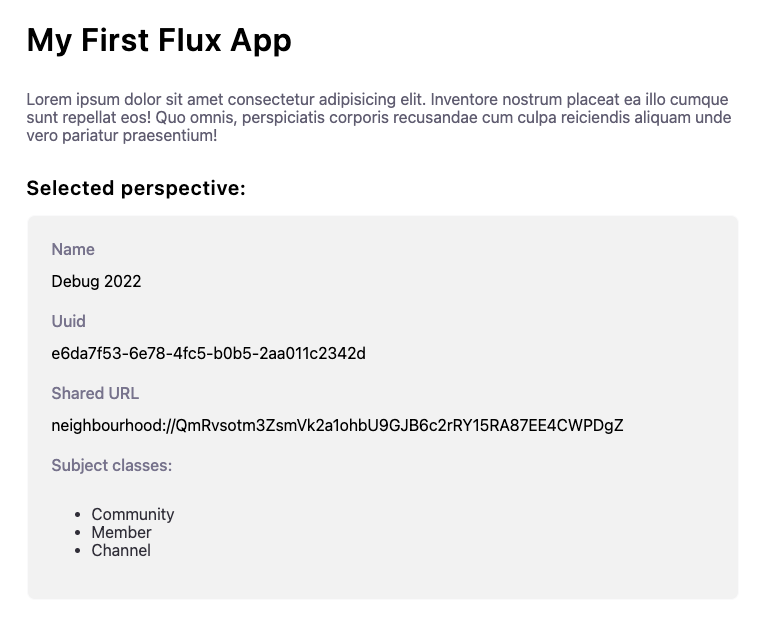

# Connecting to AD4M

Once you have your app running you'll first need to authorize [AD4M](https://ad4m.dev). The Web UI will pop up and handle this for you.

## Perspectives

In AD4M, “Perspectives” are private graph databases. When building your app you can assume that you'll be provided a perspective via the component props.

::: tip
To learn more about perspective, check out the [AD4M docs](https://docs.ad4m.dev/api.html#class-perspective).
:::

When developing the app in isolation it doesn't live in a parent Flux context, so we'll have to manually set the perspective prop. You can either do this manually or you can use the utility-view that comes with create-flux-app.

After picking a local AD4m perspective from the floating select element you'll see an output of the data in the perspective.

